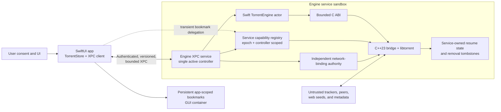

# Architecture and Security Decisions

Torrent 7 is a native macOS application split into two separately sandboxed
executables. The GUI is a pure-Swift controller and presentation process. An
embedded, application-scoped XPC service owns every torrent-engine function,
including libtorrent, the C++ bridge, network access, downloaded payload I/O,
and durable resume state.

The two important boundaries are different:

- XPC is the process isolation and privilege-separation boundary. A native
  memory-safety failure is contained outside the GUI address space.
- The C ABI is an internal language boundary inside the service. It prevents
  Swift from sharing C++ ownership, templates, exceptions, or ABI details, but
  it is not the process security boundary.

## Trust boundaries

| Boundary | Trusted fact | Still treated as untrusted |
| --- | --- | --- |
| GUI to engine service | In identified builds, XPC authenticates the exact app signing identifier from the same Team ID | Every envelope, payload, sequence, capability reference, and file descriptor |
| Engine service to GUI | In identified builds, XPC authenticates the exact embedded service signing identifier from the same Team ID | Every decoded value, count, path, identifier, revision, and dataset page |
| Swift service to C++ | The bridge owns one libtorrent client and exposes pinned C layouts | Native output lengths, strings, status codes, and all external protocol input |
| GUI bookmark store to service | The GUI currently holds user-approved access | Bookmark bytes, the resolved path, filesystem identity, lifetime, and controller ownership |
| Controller network request to service | The request describes user intent | Interface availability, identity, VPN association, and whether networking may be unblocked |
| Persistent engine state | Files are in the service container | File type, ownership, size, name, durability, and whether a saved path is currently authorized |

Same-team code signing authenticates a peer; it does not make the peer's data
safe. The service validates controller requests before native use, and the GUI
semantically validates service responses before publishing them as application
state. This remains necessary because isolating native parsing explicitly
allows for the possibility that the engine process has been compromised.

## Decisions

### Use an embedded XPC service as the outer engine abstraction

The production GUI target depends on the engine model, the XPC client, and the
UI-facing network model. It does not link `TorrentEngineCore`, `TorrentBridge`,
libtorrent, or OpenSSL. The embedded service owns those targets and is the only
production executable that can perform torrent networking.

This split is preferable to placing an XPC facade in front of an engine that
still runs in the GUI. It produces a real address-space and sandbox boundary:

- malformed torrent data and hostile network input are parsed outside the GUI;
- C++ memory corruption cannot directly mutate SwiftUI state;
- the GUI has no network entitlement;
- the service has no persistent bookmark or user-selected-file entitlement;
- a controller disconnect triggers delegated-folder invalidation and blocks the
  native session before shutdown completes.

The service is application-scoped and accepts one active controller. XPC peer,
request, queued-byte, and file-descriptor admission budgets bound work before a
request reaches the engine actor.

### Keep the C++ bridge, but only inside the service

The C++ bridge remains the right internal abstraction. Libtorrent is a stateful
C++ library whose types carry C++ ownership, exception, template, and threading
semantics. Exposing those types directly to Swift would enlarge the unsafe
surface without removing the underlying C++ dependency.

The bridge therefore remains a narrow C ABI facade with:

- C-compatible values with pinned layouts;
- explicit RAII ownership for the native client;
- bounded input and output spans;
- integer status codes and bounded diagnostics;
- no exception crossing into Swift;
- an explicit removal-commit output, separate from the optional asynchronous
  deletion token, so post-commit bookkeeping failures cannot masquerade as
  rejected removals;
- native parsing and validation wherever a decision must match libtorrent;
- native ownership of alert processing, resume durability, and removal
  tombstones.

The bridge must not become a second presentation or IPC layer. SwiftUI state,
labels, dialogs, bookmark persistence, XPC protocol state, and semantic response
validation remain in Swift. Moving the bridge into the service narrows the
consequence of a bridge defect; it does not justify relaxing bridge bounds,
static analysis, compiler hardening, or tests.

### Use a versioned, fail-closed XPC protocol

Requests and replies use typed binary-property-list payloads inside a strict XPC
envelope. The protocol includes a version, request ID, operation ID, controller
ID, strictly increasing sequence, operation, and expected engine epoch.

The following are protocol invariants:

- operation-specific request and reply byte limits are checked before decode;
- binary-property-list object tables, per-container elements, and aggregate
  collection references are structurally bounded before Foundation decoding;
- every payload uses a keyed or collection root; scalar add/remove results are
  wrapped in explicit response messages because Foundation rejects scalar
  property-list roots;
- unknown, missing, duplicate, mistyped, or unexpected envelope fields fail;
- only the legacy-state import operation may carry a file descriptor;
- request IDs and operation IDs are replay checked;
- post-handshake operations must name the current engine epoch;
- client requests are serialized, and service work is serialized per peer;
- typed busy/shutdown failures permit only a bounded fresh-session reconnect;
- a second peer racing an in-flight controller is classified as busy or
  shutting down, rather than as a same-controller protocol violation;
- an urgent network revocation preempts a long ordered request by terminating
  the controller and entering the service's out-of-band disconnect path;
- malformed uncorrelatable messages and admission-limit violations cancel the
  session rather than entering the engine;
- a fatal reply mismatch, invalid epoch, or semantic validation failure
  terminalizes the GUI transport;
- service response serialization failure is commit-ambiguous and therefore
  terminates the controller without an ordinary rejection reply; service-made
  torrent identifiers are validated before a capability is committed;
- removal warnings are UTF-8 bounded by one shared engine/client contract, so
  honest containment diagnostics remain semantically valid IPC responses;
- typed controller-busy and service-shutdown handshakes retry in the background
  with capped backoff through the service cleanup deadline and one final capped
  relaunch interval; connection invalidation remains transient only after that
  typed cleanup episode begins, while identity, protocol, and semantic failures
  are never made retryable;
- change notifications are coalesced hints only; revisions remain authoritative.

Ad-hoc signatures do not have a Team ID. Local development builds therefore use
an explicit reduced-assurance Info.plist switch on both bundles. Identified
builds omit that switch and require exact same-team signing identifiers in both
directions. Packaging verification rejects a mixed mode or a reduced-assurance
switch in an identified build.

### Retain immutable snapshots and page high-cardinality XPC datasets

Immutable revisioned snapshots remain the correct application model. SwiftUI
wants stable values, a single revision makes refresh decisions deterministic,
and a missed or coalesced wake is harmless because the next revision check is
authoritative.

Snapshot semantics are separate from wire representation. The completed XPC
transport uses this split:

| Data | Service representation | XPC transport | Client lifetime |
| --- | --- | --- | --- |
| Torrent library rows | Bounded immutable batch with one revision | Short-lived paged dataset returned by `poll` | Fully assembled and validated before replacing GUI state |
| Tracker-host index | Bounded immutable aggregate with one revision | Short-lived paged dataset returned by `poll` | Fully assembled and validated before replacing sidebar state |
| Trackers and web seeds | Demand-driven revisioned batch | Bounded inline reply | Detail cache, evictable |
| Files and piece map | Demand-driven revisioned batch | Bounded inline reply | Detail cache, evictable |
| Peer sources and web-seed activity | Small typed snapshot | Bounded inline reply | Refreshed on demand |
| Network status, bridge health, and errors | Small poll snapshot | Bounded inline reply | Replaced on poll |
| Commands | Serialized operation | Explicit success or bounded failure | No shared mutable native object |

The service captures the complete immutable high-cardinality value set first,
then encodes pages of at most 256 items, shrinking a page further when necessary
to stay under the one-MiB page limit. Datasets are owned by the controller, expire
after 30 seconds, are limited to four open datasets, and share a 128-MiB encoded
storage budget. The GUI verifies descriptor kind, revision metadata, page order,
page identity, aggregate bytes, final item count, item uniqueness, string and
numeric bounds, canonical paths, and save-path authorization. It closes a
dataset after successful assembly or a recoverable failure.

Paging does not expose partially mutable application state. The GUI publishes a
new torrent or tracker-host array only after every page has decoded and the
complete dataset has passed semantic validation.

Poll results are also scoped to GUI refresh, engine-lifecycle, and capability-
mutation generations. A response captured before a restart or folder grant is
discarded before it can update health, network state, snapshots, or bookmark
ownership.

The native bridge still has to copy and map a changed main snapshot inside the
service. At the 20,000-row limit, a 3,360-byte bridge snapshot has a 67,200,000-
byte raw batch. `Scripts/benchmark-snapshot-transport.zsh` measures that internal
C-ABI copy, Swift mapping/sorting, and transient footprint. It is no longer a
model of the XPC wire format. The published native review gates remain:

- native copy p95 at or below 25 ms;
- end-to-end date-sort median at or below 100 ms and p95 at or below 200 ms;
- name-sort p95 at or below 250 ms;
- incremental physical footprint at or below 192 MiB.

Missing a native gate is a reason to compact or page the internal bridge copy,
not to expose mutable libtorrent state to either Swift process. XPC page limits
must not be raised without separate end-to-end measurement and a resource-budget
review.

### Separate persistent bookmark ownership from transient delegation

User consent and persistent bookmark authority belong to the GUI. It stores
app-scoped security bookmarks for the default download directory and active
torrent-specific directories in its own sandbox container. It restores those
bookmarks, starts their scopes, refreshes stale persistent bookmark data when
possible, and keeps access leases alive while the paths remain needed.

The service receives a different artifact: while the GUI scope is active, the
GUI creates a transient bookmark that transfers the current sandbox extension
over XPC without sharing the persistent app-scoped bookmark. The service:

1. bounds the bookmark and aggregate grant sizes;
2. resolves without UI, mounting, or implicit scope activation;
3. explicitly starts and balances the delegated security scope;
4. requires a canonical directory path;
5. opens the directory without following the leaf as a symlink;
6. records and rechecks device and inode identity;
7. returns an opaque capability ID bound to the engine epoch and controller.

Complete authorization snapshots are prepared before publication. The service
applies the corresponding native save-path allowlist before atomically publishing
the registry replacement; an unrecoverable cross-layer commit or rollback failure
terminates the controller. A newly selected folder is a provisional capability
until the add operation succeeds. Validation failures before native add are
definite and revoke it. Once native add begins, any thrown bridge error is
commit-ambiguous because libtorrent may have accepted the torrent before a later
persistence or rollback error; the service contains and ends the controller
instead of reporting a definite rejection. Ambiguous transport failure likewise
does not issue a possibly incorrect explicit revoke. Controller disconnect is
stronger than ordinary revocation: it invalidates outstanding scopes and descriptors,
including those retained by pins.

The GUI serializes every folder delegation and exact-set replacement through an
exclusive authorization lane. A prepared add invalidates older polls, holds the
lane through delegation and commit, and forces an exact replacement after both
success and every possibly delegated failure. If exact cleanup cannot be
confirmed—including a local path or bookmark validation failure before any wire
request—the GUI immediately terminates the controller transport. Restart first
performs the same exact reconciliation and then reuses the confirmed capability
IDs; it does not incrementally resend persistent GUI authority. Capability
snapshots carry their own monotonic revision, and synchronization state is scoped
to the current engine lifecycle so an old completion cannot bless a new engine.

Paths and resume `save_path` strings are never authority by themselves. Startup
restores a torrent only when its exact canonical path is present in the current
service capability snapshot. Unauthorized resume entries are preserved and
reported rather than silently deleted.

### Make the service the sole owner of torrent-engine state

New resume data, removal tombstones, and migration markers live under an
owner-only `Torrent7/EngineState` directory in the service's Application Support
container. Native persistence keeps its existing atomic writes, directory
durability barriers, generation checks, rollback behavior, and owner-only file
permissions.

The legacy in-process engine stored resume state in the GUI container. The
service cannot and should not gain general path access to that container, so the
one-time migration is descriptor based and occurs before the engine handshake:

- the GUI opens only the exact legacy state directory and allowlisted resume or
  tombstone filenames with no-follow descriptor operations;
- owner, directory, regular-file, link, count, filename, per-file, and aggregate
  bounds are checked;
- XPC transfers one owned read-only descriptor per allowlisted file;
- the service copies verified bytes into an owner-only staging directory;
- an atomic directory exchange publishes the complete set with a validated
  commit marker;
- pre- and post-swap directory synchronization makes publication durable;
- startup removes only exact UUID-scoped staging/publication debris after
  verifying it is an owned directory;
- the legacy source tree is never traversed by the service and is never mutated,
  so it remains available for rollback.

The commit marker makes the import idempotent across launches. A migration
failure aborts engine startup instead of falling back to an in-process engine or
partially importing state.

### Keep network authority inside the engine service and fail closed

The GUI monitors interfaces for presentation and sends the network identity it
expects. That observation is not authority to unblock libtorrent. The service
runs an independent `NetworkInterfaceMonitor` and validates the controller's
interface name, interface fingerprint, and VPN service ID against its own
current snapshot.

The unblock sequence is deliberately transactional:

1. The engine starts paused and network-blocked; handshake repeats the block
   before returning success.
2. Starting the service-side monitor keeps networking blocked until an initial
   interface snapshot exists.
3. Preparing any replacement first blocks the current authorization.
4. An unrestricted request must be structurally unbound. A constrained request
   must match one unique live interface and, when required, an active VPN service.
5. A constrained decision creates a monitor-generation lease. The service
   activates it immediately before applying native settings and confirms it
   immediately afterwards.
6. Any monitor update while a constrained lease is active invalidates that lease
   and blocks the native engine. A stopped monitor, controller request,
   authorization replacement, controller disconnect, or lease race also blocks.
7. If the native block operation fails, the service destroys the engine and
   cancels the controller session; it never continues with uncertain network
   state.

Disconnect and monitor-invalidation containment do not depend indefinitely on
Swift actor progress. A five-second process-level containment watchdog is armed
before either path waits on the runtime or native engine, including the initial
pre-authority handshake block and service-initiated failure containment. It is
disarmed as soon as network containment completes; a separate five-minute cleanup
deadline bounds native restart, failed-handshake teardown, explicit shutdown,
queued deletion, scope release, and XPC transaction teardown without mistaking
slow cleanup for failed network containment. Tokens are independent, so listener
and runtime deadlines can overlap without disarming one another. Missing either
deadline terminates only the isolated helper. Forced native containment
invalidates a suspended removal before that task can reuse its captured native
pointer.

This is an application-level binding policy, not a system-wide VPN kill switch.
Hostname lookup still uses macOS system DNS, so selecting a libtorrent interface
does not independently constrain DNS traffic.

### Patch libtorrent only at boundaries the application cannot own

Tracker DNS resolution, redirects, proxy target selection, UDP sends, peer
discovery, and storage path resolution happen inside libtorrent. The application
cannot reliably secure those paths after the fact, so the pinned dependency
patch series validates destinations at every relevant transition, blocks
non-global peers during untrusted magnet metadata discovery, confines storage,
and revalidates redirect and send targets. Application source policy separately
controls allowed tracker and web-seed schemes.

Dependency patches remain ordered, hashed, reproducible, and covered by focused
security tests. Both release and sanitizer dependency profiles must record the
same patched-tree provenance; a stale unpatched profile is not an acceptable
build input.

### Split signing, entitlements, and quarantine by responsibility

Both bundles use App Sandbox, hardened runtime, `restrict`, library validation,
Enhanced Security version 2, hardened heap, dyld read-only, platform
restrictions, and checked allocations. Their capabilities otherwise differ:

| Property | GUI application | Engine XPC service |
| --- | --- | --- |
| Bundle identifier | `app.torrent7` | `app.torrent7.engine` |
| Network client/server entitlement | Absent | Present |
| User-selected read/write entitlement | Present | Absent |
| App-scoped bookmark entitlement | Present | Absent |
| C++ bridge and statically linked libtorrent/OpenSSL | Absent | Present |
| `LSFileQuarantineEnabled` | `true` | `true` |

The nested service is signed first and the outer app second. Identified
signatures must expose valid matching Team IDs. The app authenticates the exact
service identifier, and the service authenticates the exact app identifier.
Quarantine is enabled on the service because it is now the process that creates
downloaded files.

Bundle verification enforces exactly one embedded XPC service, exactly the GUI
and engine Mach-O executables, no symbolic links, exact entitlements, matching
signing modes and Team IDs, hardened code-signing flags, arm64e/PAC hardening,
BTI and typed allocation evidence in the native service, no native torrent
symbols in the GUI, and allowlisted load commands. RPATHs are limited to local
loader/executable paths; a development debug bundle may additionally reference
the explicit ASan runtime and its Xcode RPATH. `LC_DYLD_ENVIRONMENT` is forbidden.

## Non-negotiable security and resource invariants

- Production code never loads the bridge or libtorrent into the GUI process.
- The GUI has no network entitlement; the service has no persistent bookmark or
  user-selected-file entitlement.
- Identified XPC peers require exact same-team signing identifiers in both
  directions. Reduced-assurance ad-hoc mode is explicit and development-only.
- No decoded XPC value becomes engine or GUI state without operation-specific
  byte bounds, structural binary-plist bounds, and semantic validation.
- Wire payloads are container-rooted. A response serialization failure is
  commit-ambiguous and terminates the controller rather than masquerading as a
  definite operation rejection.
- Requests are serialized and bound to one controller, monotonic sequence, and
  engine epoch; replayed identifiers are rejected.
- Wake messages are hints. Revisions, not delivery count, determine freshness.
- Engine and capability-mutation generations reject poll and reconciliation
  completions captured before a restart, replacement, or prepared add.
- Main and tracker-host snapshots are immutable and fully validated before
  publication; XPC dataset pages, open datasets, lifetime, and aggregate storage
  are bounded.
- Torrent adds are admitted before expensive native state is retained. Live
  torrents, sources, files, pieces, snapshots, queues, diagnostics, peers, and
  file descriptors retain hard caps.
- Persistent bookmark ownership remains in the GUI. The service holds only
  transient, controller-scoped delegated access and invalidates it on disconnect.
- Every possibly delegated prepared folder is followed by a forced exact-set
  replacement or immediate controller termination before its local lease ends.
- Exact-set replacement fails closed even before the wire: local bookmark or
  canonicalization failure also ends the controller, and restart reuses only a
  freshly reconciled capability set.
- Canonical path text alone never grants storage authority; a live capability
  must also match the verified directory descriptor's device and inode.
- Resume restoration requires a currently authorized canonical save path.
- Resume and removal state is service-owned, atomic, owner-only, and durable.
  Unauthorized or temporarily unreadable valid entries are preserved.
- Legacy migration accepts only allowlisted owner files through owned
  descriptors, commits atomically, and never mutates the legacy tree.
- Native networking starts blocked. Only the independent service authority may
  unblock a constrained binding, and every relevant interface change or
  controller disconnect blocks it again.
- Failure to establish network containment destroys the native engine and ends
  the controller session; an independent short watchdog bounds that containment,
  while a separate longer watchdog bounds native restart and all remaining
  resource cleanup, including service-initiated shutdown.
- Tracker, redirect, proxy, UDP, peer-discovery, and storage confinement patches
  remain part of the pinned libtorrent provenance and focused test suite.
- Both bundles retain quarantine, exact entitlements, hardened runtime,
  library validation, matching identity, and an allowlisted code inventory.
- Native worker failures back off, publish typed health, and remain
  stop-token-aware so shutdown cannot inherit an unbounded retry delay.
- Detail-cache eviction may cause another refresh; it cannot change torrent
  truth or create an unbounded allocation.

## Completed migration and ongoing gates

| Area | Current state | Ongoing gate |
| --- | --- | --- |
| GUI/engine process isolation | Completed; production GUI is Swift-only and the embedded XPC service owns the engine | Bundle symbol and exact Mach-O inventory verification |
| XPC identity and protocol | Completed; mutual identified-peer requirements, epochs, sequences, replay checks, budgets, and response validation | IPC codec/client security tests plus signed-bundle verification |
| C++ bridge placement | Completed inside the service only | Bridge static analysis, strict warnings, lifecycle tests, and native symbol audit |
| Snapshot transport | Immutable revision model retained; main and tracker-host XPC transport is paged | Dataset bound/validation tests and native snapshot benchmark before changing limits |
| Folder authority | Persistent GUI bookmarks plus transient service capabilities completed | Bookmark, transaction, replacement, disconnect, and restoration tests |
| State ownership and migration | Service-owned persistence and one-time atomic descriptor migration completed | Persistence, crash-recovery, durability-failure, and migration tests |
| Network authority | Independent service monitor and generation lease completed | Binding-race, monitor-change, disconnect, and libtorrent network-security tests |
| Packaging split | Separate entitlements, signing, quarantine, and code inventory completed | Production and sanitizer app builds plus verifier; distribution notarization and Gatekeeper |
| Dependency confinement | Ordered pinned patch series completed | Patch provenance and focused security suite for every dependency or toolchain change |

The XPC migration is the production architecture, not a compatibility path.
Future transport or performance work may change encoding and batching within the
published bounds, but it must preserve the process split, snapshot semantics,
capability ownership, service-side network authority, and fail-closed behavior.
