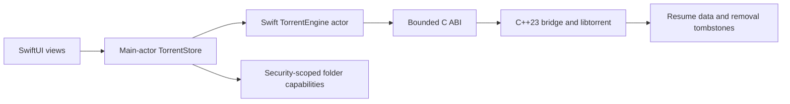

# Architecture and Security Decisions

Torrent 7 is a native macOS application with three deliberate boundaries:



The design goal is not to hide libtorrent behind a large object model. It is to
keep unsafe native work, filesystem durability, and untrusted protocol parsing
behind a small contract that Swift can call without sharing C++ ownership or
exception semantics.

## Decisions

### Keep the C++ bridge, but keep it narrow

The bridge is the right abstraction, more precisely as a bounded C ABI facade
over a C++23 libtorrent adapter. Libtorrent is a stateful C++ library, and
exposing its types directly to Swift would couple the UI to C++ ABI, lifetimes,
exceptions, templates, and threading. The bridge instead provides:

- C-compatible value types with pinned layouts;
- explicit ownership for the client handle;
- bounded input and output buffers;
- integer status codes and bounded diagnostic strings;
- no exception crossing the language boundary;
- native parsing and validation whenever a decision must match libtorrent.

The bridge should not become a second application layer. Presentation,
selection, labels, dialogs, and security-scoped bookmark ownership remain in
Swift. Torrent/session mechanics, alert processing, resume durability, and
libtorrent-specific validation remain native.

### Use snapshots for the library, demand-driven revisions for details

Immutable snapshots are a good fit for the main torrent library. SwiftUI wants
stable values, sorting is naturally expressed in Swift, and a revision lets the
engine return before allocating or mapping when nothing changed.

A single eager snapshot of every detail is not the right model. Trackers, web
seeds, files, and piece maps are requested only while their view is active. Each
detail family has its own revision, count cap, and cache budget. Wake callbacks
are change hints; revision checks remain authoritative and make a missed or
coalesced wake harmless.

The intended transport split is therefore:

| Data | Transport | Lifetime |
| --- | --- | --- |
| Torrent rows | Bounded immutable batch | Session-wide, revisioned |
| Tracker hosts | Bounded aggregate batch | Sidebar index, revisioned |
| Trackers/web seeds | Demand-driven batch | Detail cache, revisioned and evictable |
| Files/piece map | Demand-driven batch | Detail cache, revisioned and evictable |
| Network/bridge health | Small typed snapshot | Polled on wake/refresh |
| Commands | Serialized operations | Explicit success/failure and bounded diagnostics |

Snapshot semantics and full-batch transport are separate decisions. The
semantic model is sound: immutable values, one authoritative revision, and
change-driven refreshes fit SwiftUI well. The current wire representation is a
provisional implementation choice. At the hard limit, 20,000 rows at a 3,360
byte ABI stride require a 67,200,000-byte native batch before Swift mapping and
sorting. Revision checks avoid that cost when the library is unchanged, but a
changed maximum-size library still needs measurement on supported hardware.

The release probe is intentionally opt-in so ordinary tests never allocate the
maximum fixture:

```sh
Scripts/benchmark-snapshot-transport.zsh
```

It reports native copy, Swift allocation/copy, mapping, date and name sorting,
end-to-end latency, and incremental physical footprint. Timings are diagnostic,
not flaky test assertions. The current transport remains acceptable when a
slowest-supported reference machine stays within these review gates:

- native copy p95 at or below 25 ms;
- end-to-end date-sort median at or below 100 ms and p95 at or below 200 ms;
- name-sort p95 at or below 250 ms;
- incremental physical footprint at or below 192 MiB.

Missing a gate is the trigger to prototype paging or a compact/delta transport.
It is not a reason to discard snapshot semantics or expose mutable native state
to Swift.

### Treat folder access as a capability

Swift owns security-scoped folder access because it owns App Sandbox bookmarks
and user consent. A folder selection is prepared in memory, its access lease is
held through the queued native add, and bookmark/default state is committed only
after libtorrent accepts the torrent.

Resume restoration must follow the same rule: a persisted `save_path` is not an
authority by itself. Startup may restore a torrent only when that exact path is
backed by a successfully restored folder capability. Resume entries that cannot
currently be authorized are preserved and reported, not silently deleted.

### Keep one owner for command ordering

`TorrentStore` owns application-level ordering. User mutations and Torrent Info
mutations share one bounded FIFO. A network restriction is an urgent barrier:
it may preempt queued user work, but its generation is tracked and it is drained
before later operations, save, or shutdown.

`TorrentEngine` remains an actor so a client handle is never used concurrently
from Swift. The native alert worker owns libtorrent alert pumping and publishes
coalesced dirty masks outside the client lock.

### Patch the dependency only for boundaries libtorrent owns

Tracker DNS resolution, redirects, proxy target selection, and UDP sends happen
inside libtorrent. The application cannot reliably secure those paths after the
fact, so the pinned dependency patch validates every resolved destination and
revalidates at redirect/send boundaries. Application source policy remains a
separate layer that controls which tracker and web-seed schemes are allowed.

Dependency patches must stay ordered, reproducible, hermetically tested, and
small enough to re-audit when the pinned libtorrent version changes.

## Security and resource invariants

- A torrent add is admitted before expensive native state is retained.
- Live torrents, source lists, files, snapshots, tracker-host rows, piece maps,
  queued operations, pending errors, and native identity tokens have hard caps.
- Late libtorrent alerts resolve a compact stable token; retired heavyweight
  identity state is reclaimed only after pointer users quiesce.
- Resume and removal state is written atomically with owner-only permissions.
- An unreadable or temporarily unauthorized resume entry is preserved. Only
  data that is definitively invalid under the persistence contract is removed.
- Non-global tracker endpoints are rejected after every DNS resolution,
  redirect, and UDP send selection. Proxy settings cannot delegate target DNS
  after local validation.
- Native worker failures back off, publish typed health, and remain
  stop-token-aware so shutdown cannot inherit a retry delay.
- Detail cache eviction may cause a refresh, never an unbounded allocation or a
  change to torrent/session truth.

## Refreshed implementation status

Security work changed the order of the original architecture plan. Boundary
correctness preceded broader transport work, and the completed pieces should
remain release invariants rather than compatibility paths:

| Area | Status | Ongoing gate |
| --- | --- | --- |
| Tracker endpoint, redirect, proxy, and UDP confinement | Implemented | Re-audit and run dependency-security tests whenever the libtorrent pin or patch series changes |
| Transactional folder capabilities and command/network ordering | Implemented | Swift ordering, capability-lifetime, restart, and restoration tests |
| Native parsing, torrent identity, resume durability, and bridge health | Implemented and bounded | Bridge static analysis, lifecycle tests, and bounded diagnostics |
| Revision-aware main/detail snapshots and aggregate detail caches | Implemented | Resident-vs-empty, deterministic eviction, payload, entry-count, and tracker-host cap tests |
| Maximum main-snapshot transport | Retained provisionally | Run the release probe on the slowest supported reference machine; prototype paging or compact deltas only if a gate is missed |
| Release evidence | Continuous gate | Swift, bridge, dependency-security, fuzz, app-build, and signed-bundle verification |

The remaining architectural decision is empirical rather than structural: keep
the measured full-batch transport while it meets the published gates, and
change only that transport if it stops doing so. The C ABI facade and immutable
snapshot model remain the intended boundaries.
