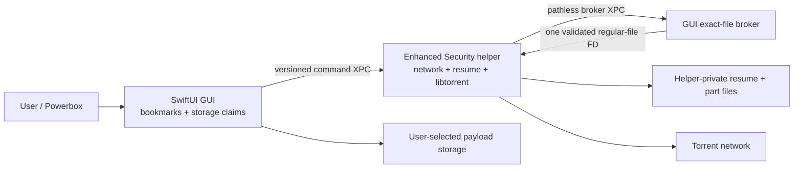

# Architecture and security decisions

Torrent 7 is split into two separately sandboxed executables and two mutually
authenticated XPC channels. The split is an authority boundary, not merely a
deployment detail.


```mermaid
flowchart LR
    User["User / Powerbox"] --> GUI["SwiftUI GUI\nbookmarks + storage claims"]
    GUI -->|"versioned command XPC"| Helper["Enhanced Security helper\nnetwork + resume + libtorrent"]
    Helper -->|"pathless broker XPC"| Broker["GUI exact-file broker"]
    Broker -->|"one validated regular-file FD"| Helper
    GUI --> Disk["User-selected payload storage"]
    Helper --> Private["Helper-private resume + part files"]
    Helper --> Network["Torrent network"]
```

The GUI owns all user-filesystem authority. The helper owns torrent protocol
execution and network authority. A helper request can identify only a storage
claim, its immutable generation, a file index, and requested access. It cannot
name or discover a path.

## Process and authority split

| Responsibility | GUI application | Engine helper extension |
| --- | --- | --- |
| SwiftUI, Finder, notifications, preferences | Owns | None |
| User consent and persistent security-scoped bookmarks | Owns | None |
| Torrent manifest safety parsing | Owns an independent Swift parser | Libtorrent parses independently |
| Destination selection, reservation, and mapping | Owns | None |
| Durable storage claims and ownership evidence | Owns | None |
| Exact payload file access | Brokers individual descriptors | Consumes brokered descriptors |
| Payload rename, move, and deletion | Owns | None |
| Torrent networking and discovery | None | Owns |
| Libtorrent, C++ bridge, resume state | None | Owns |
| Skipped-file part data | None | Owns in its private container |

The GUI executable has no network entitlement and does not link the C++ bridge
or libtorrent. The helper has no user-selected-file or bookmark entitlement.
The former folder-wide authority model was removed at the cutover; there is no
parallel compatibility path.

## Command channel

The application-scoped Enhanced Security helper is discovered and launched by
ExtensionFoundation. Each engine generation uses a fresh authenticated XPC
session. Identified builds require the expected application and helper signing
identifiers from the same Team ID. Local ad-hoc integration fixtures use an
explicit reduced-assurance mode.

Command IPC version 10 uses typed, operation-specific envelopes with bounded
JSON and raw attachments. Requests carry an engine epoch, monotonic sequence,
and replay identifier. The implementation bounds queue depth, nesting, value
count, strings, raw torrent bytes, piece-map data, paged datasets, and response
sizes before allocating or decoding deeply.

Errors after native mutation begins are treated as commit-ambiguous. The client
does not retry or report a definite rejection when libtorrent may already have
accepted an operation. Controller replacement always starts from a newly
blocked network state.

## Independent manifest validation

Before the GUI creates a claim, `TorrentManifestParser` parses the original
`.torrent` bytes using a bounded, memory-safe Swift bencode reader. It locates
the exact raw `info` dictionary and produces immutable logical storage data.

Validation includes:

- v1, v2, hybrid, and rootless-v2 layouts;
- applicable SHA-1 and SHA-256 info hashes;
- contiguous file indices matching libtorrent;
- v2 file trees, padding files, and hybrid layout equivalence;
- metadata, nesting, byte-string, component, and file-count bounds;
- strict UTF-8 and rejection of NUL, separators, `.`, and `..`;
- rejection of symlinks and unsafe path attributes; and
- duplicate, case-insensitive, and normalization-equivalent path detection.

The parser hashes a canonical logical representation into a
`sourceManifestDigest`. Libtorrent independently derives the same digest. A
mismatch aborts activation, so neither parser alone decides the physical
mapping.

For a magnet, metadata discovery happens only in helper-private staging. The
helper returns the exact received `info` bytes. The GUI verifies them against
the advertised magnet hash before parsing or creating user-visible storage.

## Destination planning

`TorrentStorageDestinationPlanner` runs only in the GUI. Normal adds reserve a
new top-level file or directory atomically and choose Finder-style collision
names through exclusive creation. Libtorrent never chooses or rewrites the
physical destination.

Filesystem operations start from a GUI-held directory descriptor. Every path
component is traversed separately with descriptor-relative operations and
`O_NOFOLLOW`, `O_DIRECTORY`, and `O_CLOEXEC` as appropriate. Creation uses
exclusive `mkdirat` or `openat` calls. The planner verifies type and filesystem
identity after opening and rejects symlinks, special files, hidden top-level
names, and dangerously broad parents.

Normal addition never reuses matching files. “Use Existing Data” is an explicit
import operation. Imported files are identity-pinned, must be safe regular
files, and are never marked for automatic deletion. Writable imports additionally
require user ownership and a single hard link.

## Storage claims

Immutable authority and mutable policy are separate.

`TorrentStorageManifest` records:

- a random claim ID and positive generation;
- v1 and/or v2 info hashes and the source manifest digest;
- the GUI parent-authority identifier;
- logical files and exact index-to-component mappings;
- expected sizes and padding status;
- the collision-selected top-level name and pinned filesystem identities;
- a digest of the complete physical mapping; and
- random ownership-marker material kept out of the helper.

`TorrentStorageLease` records lifecycle state, policy revision, maximum access,
provenance, modification permission, and automatic-deletion ownership for each
file. Padding files are always unavailable and have no physical mapping.

Generation changes only when immutable authority is replaced. Policy changes
increment the policy revision without pretending to revoke descriptors that a
compromised helper might already hold.

## Crash-consistent journal

The GUI persists claims in a bounded owner-only journal using descriptor-relative
I/O, atomic replacement, durability barriers, and a checksum. It does not use
`UserDefaults` for storage authority.

The principal lifecycle is:

```text
preparing -> reserved -> activating -> active
                              |
                              +-> activationUnknown

active -> removing -> deleting -> deleted
                         |
                         +-> deletionPending

unprovable state -> orphaned
```

Each operation carries an idempotent random nonce. Filesystem mutation and
journal commits are never treated as one transaction. Recovery checks stored
identity and authenticated app-ownership evidence. A matching name alone never
proves ownership.

An `activating` claim found after a crash becomes `activationUnknown`, retains
its exact broker authority, and is restored without guessing whether native add
committed. After the first engine snapshot, matching torrents are paused before
normal network settings are applied. User resume commands exclude them. If the
pause cannot be confirmed, the app terminates the engine connection and leaves
the claim unresolved.

If bookmark or root identity restoration fails, an active, activating, or
unknown claim becomes orphaned and remains preserved. Ambiguous deletion becomes
`deletionPending`; it is not retried as if ownership were certain.

## Exact-file broker

The GUI creates an anonymous `XPCListener` before constructing or restoring the
engine. The command handshake carries its typed endpoint and a random session
nonce. The broker is bound to one engine epoch and accepts only the expected
helper identity; the helper applies the reciprocal application identity
requirement.

The broker protocol contains only:

```text
handshake(engineEpoch, sessionNonce, requestID, deadline)
openPayload(claimID, generation, fileIndex, access)
statBatch(claimID, generation, fileIndices)
```

Requests and replies are bounded and deadline-limited. Work runs off the main
queue. Request IDs correlate replies but do not grant authority. Claim creation,
paths, directory descriptors, rename, move, and deletion are deliberately absent.

For every open, the broker validates the current claim and generation, recomputes
the immutable mapping digest, checks lease policy, traverses each stored
component from the verified parent descriptor, and compares the opened object
with its pinned identity. It rejects links, non-regular files, unexpected hard
links, size violations, stale mappings, and access beyond policy. A successful
reply carries exactly one descriptor plus bounded `fstat` metadata.

## Engine broker client and native provider

The helper connects to and handshakes with the broker before constructing
`TorrentEngine`. Its dedicated client has bounded concurrency, five-second
requests, cancellation that wakes blocked workers, strict reply correlation,
and `fstat` validation of every returned descriptor. The synchronous C callback
surface is used only by libtorrent disk workers; no libtorrent network-thread
lock is held while waiting.

The C ABI stores a retained provider context with explicit retain and release
callbacks. It passes only the 16-byte claim identifier, generation, file index,
and read/write intent. Callback errors remain failures; they never become path
lookups.

The downstream libtorrent patch threads the provider through
`add_torrent_params`, `storage_params`, `pread_storage`, file handling, stat
caches, resume checking, recheck, hashing, and file-priority paths. Provider
mode is accepted only by the patched pread backend.

In provider mode:

- payload opens and size checks use only the provider;
- padding files never request a descriptor;
- a synthetic private save location is used only for engine-private part data;
- skipped-file bytes live under `EngineState/PartFiles/<claimID>`;
- rename and move are rejected;
- remove may delete the private part file but never user payloads; and
- provider failure has no pathname fallback.

## Activation and import

A known torrent follows this order:

```text
original bytes
-> independent Swift parse
-> destination planning and exclusive reservation
-> durable reserved claim
-> activating claim
-> engine add with pathless activation
-> independent native digest validation
-> active claim
```

No claim or journal lock is held across engine add because libtorrent may ask
the broker for a descriptor immediately. The activation object contains only
claim ID, generation, source digest, and an optional preserved torrent identity
used during magnet promotion.

File access is enabled in the broker before priority increases are sent to the
engine. Restrictions are committed after native handle-release operations.
Provenance is independent of access: an app-created file can be automatically
deleted; an imported file cannot.

## Magnet promotion

Metadata-less magnets initially use only helper-private staging. Promotion is a
durable GUI transaction:

```text
exact info bytes
-> advertised-hash verification
-> Swift manifest parse
-> destination confirmation and claim creation
-> internal remove and broker-backed re-add
```

The re-add preserves the public torrent ID, queue position, pause state,
priorities, options, source policy, and validated metadata. The journal records
awaiting-metadata, metadata-ready, promoting, and outcome-unknown states so a
crash does not silently refetch or guess the result.

## Removal and revocation

The engine removes the torrent from libtorrent and releases file-pool handles
without deleting payloads. The GUI then verifies claim generation, filesystem
identity, provenance, and app ownership before deleting any manifest object.
Imported and unknown files are always preserved.

Hard revocation invalidates command and broker sessions and invalidates the
helper process. A new engine epoch is not created until the old process is no
longer authoritative. If immediate termination is uncertain, deletion remains
pending for clean-launch recovery. A cooperative helper acknowledgement is
useful operational evidence, not security proof.

## Persistence cutover

Broker-backed resume records contain the pathless storage activation and an
explicit broker validation marker. Records without that authority are preserved
on disk but skipped during restore. Payload data is untouched. There is no
automatic path migration and no old filesystem-authority API in Swift, IPC, the
C ABI, or native restore logic.

Resume state and removal tombstones remain in the helper's private container.
The claim journal and security-scoped bookmarks remain in the GUI container.

## Network authority

The helper starts with networking blocked. It unblocks only after its own
interface monitor validates the selected interface fingerprint and, where
required, VPN service identity. The networkless GUI receives a bounded picker
snapshot without raw local addresses.

Disconnects, constrained-interface changes, monitoring failures, failed
replacement, and revocation return to blocked state. Separate containment and
cleanup watchdogs cover startup, restart, shutdown, disconnect, and scope
cleanup so an unresponsive native engine cannot leave network authority active.

## Native and dependency hardening

The C++23 bridge uses RAII, `std::span`, `std::expected`, strict warnings, and no
exception crossing the Swift boundary. The C ABI documents lifetime-scoped
borrows and validates every count, pointer, enum, identifier, activation, and
callback table. Stored callbacks and long-lived opaque contexts use diversified
pointer authentication in arm64e production builds.

Libtorrent and BoringSSL are pinned, patched, verified, and linked statically.
The app bundle contains only the GUI and helper Mach-O executables. TLS uses the
buffer-only BoringSSL client path with macOS system trust and hostname binding.
The release profiles enable hardened runtime, library validation, checked
allocations, hardened heap, dyld read-only data, platform restrictions, stack
protection, fortify, hidden visibility, PAC, BTI, and trap-only sanitizer checks.

## Non-negotiable invariants

1. The helper receives no bookmark, payload path, or parent directory descriptor.
2. A broker request never contains a path.
3. Only the GUI creates claims, physical mappings, destinations, or payload files.
4. A successful broker open grants one exact regular-file descriptor.
5. Libtorrent has no path fallback while a provider is installed.
6. Padding files never receive descriptors.
7. Only the GUI can delete user payloads.
8. Imported files are never automatically deleted.
9. Ambiguous activation, ownership, or deletion is preserved and paused.
10. The helper starts blocked and cannot grant itself network authority.

## Verification

The routine gates are:

```sh
Scripts/analyze-bridge.zsh
Scripts/test-bridge.zsh
Scripts/test-swift.zsh
```

The bridge analysis gate applies and validates the ordered libtorrent patch
series. Bridge and Swift tests cover provider routing, no-fallback behavior,
resume cutover, parser bounds, destination races, broker authentication and FD
validation, claim recovery, ambiguous activation containment, imports, removal,
and magnet promotion. Separate fuzz harnesses cover native API and parser input
surfaces; their expensive build and execution are intentionally independent of
the routine test gates.
