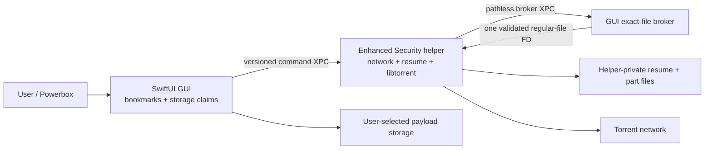

# Architecture and security decisions

Torrent 7 is split into two separately sandboxed executables and two mutually
authenticated XPC channels. The split is an authority boundary, not merely a
deployment detail.


```mermaid
flowchart LR
    User["User / Powerbox"] --> GUI["SwiftUI GUI\nbookmarks + storage claims"]
    GUI -->|"versioned command XPC"| Helper["Enhanced Security helper\nnetwork + resume + libtorrent"]
    Helper -->|"pathless broker XPC"| Broker["GUI exact-file broker"]
    Broker -->|"one validated regular-file FD"| Helper
    GUI --> Disk["User-selected payload storage"]
    Helper --> Private["Helper-private resume + part files"]
    Helper --> Network["Torrent network"]
```

The GUI owns all user-filesystem authority. The helper owns torrent protocol
execution and network authority. A helper request can identify only a storage
claim, its immutable generation, a file index, and requested access. It cannot
submit a path or receive a directory capability. An issued file descriptor may
reveal its pathname through facilities such as `F_GETPATH`; path knowledge is
therefore neither treated as secret nor accepted as filesystem authority.

Within the GUI process, `TorrentApp` is the MainActor-isolated SwiftUI and
presentation module. `TorrentAppInfrastructure` contains concurrency-neutral
domain values plus actor-owned persistence, bookmark, and storage-authority
services. This module split is an isolation boundary for Swift concurrency, not
a process or trust boundary; both modules execute with the GUI's sandbox
authority. All Swift targets enable approachable-concurrency semantics, while
non-UI modules retain explicit nonisolated default isolation.

## Process and authority split

| Responsibility | GUI application | Engine helper extension |
| --- | --- | --- |
| SwiftUI, Finder, notifications, preferences | Owns | None |
| User consent and persistent security-scoped bookmarks | Owns | None |
| Torrent manifest safety parsing | Owns Swift preview and claim parsing | Owns production Swift parsing and typed native import |
| Magnet parsing | Owns the shared bounded Swift parser | Revalidates the typed model and imports flat records |
| Swarm info-dictionary parsing | None | Hashes in libtorrent, parses synchronously in Swift, imports a typed capsule |
| Peer extension message parsing | None | Parses BEP 10, BEP 9 control, and BEP 11 synchronously in Swift; applies native state and policy |
| HTTP tracker body parsing | None | Bounds the decompressed body, parses it synchronously in Swift, imports typed peers and statistics |
| DHT KRPC parsing | None | Parses bounded datagrams synchronously in Swift; imports typed queries, responses, errors, nodes, and peers |
| Destination selection, reservation, and mapping | Owns | None |
| Durable storage claims and ownership evidence | Owns | None |
| Exact payload file access | Brokers individual descriptors | Consumes brokered descriptors |
| Payload rename, move, and deletion | Owns | None |
| Torrent networking and discovery | None | Owns |
| Libtorrent, C++ bridge, resume state | None | Owns |
| Skipped-file part data | None | Owns in its private container |

The GUI executable has no network entitlement and does not link the C++ bridge
or libtorrent. The helper has no user-selected-file or bookmark entitlement.
The former folder-wide authority model was removed at the cutover; there is no
parallel compatibility path.

## Saved settings and network authorization

Only an absent settings record uses first-launch defaults. An existing record
must contain every field in the current format, with valid types and canonical
values. Missing or null fields, obsolete partial records, inconsistent VPN
policy, and other corruption require explicit recovery; loading never repairs
or overwrites them. Current records written by the app remain valid without
migration.

During settings loading or recovery, every engine settings application keeps
networking blocked, including after engine replacement. Ordinary settings edits
cannot overwrite the unreadable record or release that block. Settings presents
a recovery view; the existing Restore All Defaults action replaces the record
only after confirmation that network interface and VPN restrictions will be
removed. An explicit reset is persisted and applied even when the displayed
placeholder already equals the defaults. Sorting and other independent saved
state can still load without granting network authorization.

## Command channel

The application-scoped Enhanced Security helper is discovered and launched by
ExtensionFoundation. Each engine generation uses a fresh authenticated XPC
session. Identified builds require the expected application and helper signing
identifiers from the same Team ID. Local ad-hoc integration fixtures use an
explicit reduced-assurance mode.

Discovery and process launch use shared acquisitions with generation-checked
handles. Each caller can cancel or reach its deadline independently, and a
completed shared handle remains available to later callers. One 305-second
connection deadline covers discovery, launch, the command handshake, and all
retry attempts.

Command IPC version 13 uses typed, operation-specific envelopes with bounded
JSON and raw attachments. Requests carry an engine epoch, monotonic sequence,
and replay identifier. The implementation bounds queue depth, nesting, value
count, strings, raw torrent bytes, piece-map data, paged datasets, and response
sizes before allocating or decoding deeply.
Envelope UUIDs must occupy exactly 36 raw XPC bytes and error messages at most
4 KiB; these lengths are checked before conversion to Swift strings.

Errors after native mutation begins are treated as commit-ambiguous. The client
does not retry or report a definite rejection when libtorrent may already have
accepted an operation. Controller replacement always starts from a newly
blocked network state.

## Independent manifest validation

Before the GUI creates a claim, `TorrentManifestParser` parses the original
`.torrent` bytes using a bounded, memory-safe Swift bencode reader. It locates
the exact raw `info` dictionary and produces immutable logical storage data.

Validation includes:

- v1, v2, hybrid, and rootless-v2 layouts;
- applicable SHA-1 and SHA-256 info hashes;
- contiguous file indices matching libtorrent;
- v2 file trees, padding files, and hybrid layout equivalence;
- metadata, nesting, byte-string, component, and file-count bounds;
- strict UTF-8 and rejection of NUL, separators, `.`, and `..`;
- rejection of symlinks and unsafe path attributes; and
- duplicate, case-insensitive, and normalization-equivalent path detection.

The parser hashes a canonical logical representation into a
`sourceManifestDigest`. Libtorrent independently derives the same digest. A
mismatch aborts activation, so neither parser alone decides the physical
mapping.

For a magnet, metadata discovery happens only in helper-private staging. The
helper returns the exact received `info` bytes. The GUI verifies them against
the advertised magnet hash before parsing or creating user-visible storage.

## Destination planning

`TorrentStorageDestinationPlanner` runs only in the GUI. Normal adds reserve a
new top-level file or directory atomically and choose Finder-style collision
names through exclusive creation. Libtorrent never chooses or rewrites the
physical destination.

Filesystem operations start from a GUI-held directory descriptor. Every path
component is traversed separately with descriptor-relative operations and
`O_NOFOLLOW`, `O_DIRECTORY`, and `O_CLOEXEC` as appropriate. Creation uses
exclusive `mkdirat` or `openat` calls. The planner verifies type and filesystem
identity after opening and rejects symlinks, special files, hidden top-level
names, and dangerously broad parents.

Normal addition never reuses matching files. “Use Existing Files” appears only
after a destination conflict and is an explicit import operation. Imported
files are identity-pinned safe regular files owned by the current user with a
single hard link. They are preserved unless the user later explicitly requests
payload deletion; unrelated imported directory contents are always preserved.

## Storage claims

Immutable authority and mutable lease state are separate.

`TorrentStorageManifest` records:

- a random claim ID and positive generation;
- v1 and/or v2 info hashes and the source manifest digest;
- the parent directory's pinned filesystem identity;
- logical files with expected sizes and padding status;
- canonically indexed file and directory identities;
- the collision-selected top-level name;
- a digest of the complete physical authority; and
- claim-wide ownership: imported, or app-created with a random HMAC key stored
  only in the GUI journal.

Each app-created object stores an HMAC tag over the claim, generation, canonical
relative mapping, object kind, device, inode, owner UID, and file generation.
The helper can read a tag through an issued descriptor, but never receives the
key; copying a tag to another object or mapping does not authenticate it.

`TorrentStorageLease` records lifecycle state, availability revision, and one
availability bit per logical file. Claim-wide ownership determines whether
object-bound HMAC tags are required. Imported objects are writable only after
the explicit conflict choice and remain identity- and hard-link-pinned. Padding
files are always unavailable and have no physical identity.

Generation changes only when immutable authority is replaced. Availability
changes increment the availability revision without pretending to revoke
descriptors that a compromised helper might already hold.

## Crash-consistent journal

The GUI persists claims in a bounded owner-only journal using
descriptor-relative I/O, atomic replacement, and durability barriers. It does
not use `UserDefaults` for storage authority.

The principal lifecycle is:

```text
preparation -> reserved -> activating -> active
                                |
                                +-> activationUnknown

active -> removing -> claim retired (keep payload)
                    |
                    +-> deleting -> claim retired
                             |
                             +-> deletionPending

unprovable state -> orphaned
```

Preparation is a separate durable record rather than a claim state. Each
operation carries an idempotent random nonce. Filesystem mutation and journal
commits are never treated as one transaction. Successful removal deletes the
claim record instead of retaining a tombstone. Recovery checks stored identity
and authenticated app-ownership evidence; a matching name alone never proves
ownership. An interrupted keep-payload removal can retire its claim without
touching the payload.

An `activating` claim found after a crash becomes `activationUnknown`, retains
its exact broker authority, and is restored without guessing whether native add
committed. After the first engine snapshot, matching torrents are paused before
normal network settings are applied. User resume commands exclude them. If the
pause cannot be confirmed, the app terminates the engine connection and leaves
the claim unresolved.

If bookmark or root identity restoration fails, an active, activating, or
unknown claim becomes orphaned and remains preserved. Ambiguous deletion becomes
`deletionPending`; it is not retried as if ownership were certain.

## Exact-file broker

The GUI creates an anonymous `XPCListener` before constructing or restoring the
engine. The command handshake carries its typed endpoint and a random session
nonce. The broker is bound to one engine epoch and accepts only the expected
helper identity; the helper applies the reciprocal application identity
requirement.

The broker protocol contains only:

```text
handshake(engineEpoch, sessionNonce, requestID, deadline)
openPayload(claimID, generation, fileIndex, access)
statBatch(claimID, generation, fileIndices)
```

Requests and replies are bounded and deadline-limited. Raw XPC lengths are
checked before values are copied or bridged, and the server rejects excessive
in-flight work, request rates, and distant deadlines. Malformed or abusive
sessions are cancelled. Work runs off the main queue. Request IDs correlate
replies but do not grant authority. Claim creation, paths, directory descriptors,
rename, move, and deletion are deliberately absent.

Claim installation uses the same central validator as journal loading. For
every open, the broker validates the current claim and generation, checks
availability, directly indexes the immutable mapping, traverses each stored
component from the verified parent descriptor, and compares the opened object
with its pinned device, inode, link count, owner UID, and file generation. Leaf
opens use `O_NONBLOCK` before type validation, so substituted FIFOs cannot
occupy a worker waiting for a peer. The broker rejects links, non-regular files,
unexpected hard links, size violations, stale mappings, invalid ownership tags,
and unavailable content. A successful reply carries exactly one descriptor
plus bounded `fstat` metadata.

`statBatch` can return bounded metadata for a mapped unavailable file, but
cannot return its descriptor or contents. In this model,
unavailable means content-unavailable rather than entirely unobservable.

## Engine broker client and native provider

The helper connects to and handshakes with the broker before constructing
`TorrentEngine`. Its dedicated client has bounded concurrency, five-second
requests, cancellation that wakes blocked workers, strict reply correlation,
and `fstat` validation of every returned descriptor. The synchronous C callback
surface is used only by libtorrent disk workers; no libtorrent network-thread
lock is held while waiting.

The C ABI stores a retained provider context with explicit retain and release
callbacks. It passes only the 16-byte claim identifier, generation, file index,
and read/write intent. Callback errors remain failures; they never become path
lookups.

The downstream libtorrent patch threads the provider through
`add_torrent_params`, `storage_params`, `pread_storage`, file handling, stat
caches, resume checking, recheck, hashing, and file-priority paths. Provider
mode is accepted only by the patched pread backend.

In provider mode:

- payload opens and size checks use only the provider;
- padding files never request a descriptor;
- a synthetic private save location is used only for engine-private part data;
- skipped-file bytes live under `EngineState/PartFiles/<claimID>`;
- rename and move are rejected;
- remove may delete the private part file but never user payloads; and
- provider failure has no pathname fallback.

## Residual file capabilities

The containment boundary is spatial. A compromised helper controls every
content-authorized file across all `.activating`, `.active`, and
`.activationUnknown` claims, plus descriptors and bytes it retained earlier.
For an issued file it may recover the path string, duplicate or map the
descriptor, read or corrupt allowed contents, lock the file, and attempt
descriptor-scoped metadata changes. It also retains its private state and
network authority and can cause availability damage.

Those capabilities do not let it submit an arbitrary path, obtain a parent or
sibling directory descriptor, traverse from a regular-file descriptor, or ask
the broker to create, rename, move, link, or unlink a user path. Padding and
content-unavailable files cannot receive content descriptors, and provider
failure cannot fall back to a pathname.

## Activation and import

A known torrent follows this order:

```text
original bytes
-> independent Swift parse
-> destination planning and exclusive reservation
-> durable reserved claim
-> activating claim
-> engine add with pathless activation
-> independent native digest validation
-> active claim
```

No claim or journal lock is held across engine add because libtorrent may ask
the broker for a descriptor immediately. The activation object contains only
claim ID, generation, source digest, and an optional preserved torrent identity
used during magnet promotion.

File availability is enabled in the broker before priority increases are sent
to the engine. Restrictions are committed after native handle-release
operations. Ownership is claim-wide and independent of availability: automatic
cleanup requires app-created ownership evidence, while an explicit user delete
may remove identity-pinned imported manifest objects.

## Magnet promotion

Metadata-less magnets initially use only helper-private staging. Promotion is a
durable GUI transaction:

```text
exact info bytes
-> advertised-hash verification
-> Swift manifest parse
-> destination confirmation and claim creation
-> internal remove and broker-backed re-add
```

The re-add preserves the public torrent ID, queue position, pause state,
priorities, options, source policy, and validated metadata. The journal records
awaiting-metadata, metadata-ready, promoting, and outcome-unknown states so a
crash does not silently refetch or guess the result.

The replacement starts manually paused. Saved transfer limits and discovery
restrictions are restored before automatic management is enabled; a failed or
cancelled restoration leaves it paused for a later retry.
The saved pause intent distinguishes a user pause from auto-managed queue
suspension, so waiting magnets remain eligible when a queue slot becomes free.
Before resuming, one bounded queue-restoration command reapplies the saved
position within its priority group. The Swift queue owner excludes completed
torrents from position counting and bounds the position to the remaining queue
if other torrents were removed while destination confirmation was pending.

After metadata validation and before broker-backed re-add, the helper persists
the exact info bytes with an explicit staged-metadata marker and the intended
file priorities. Restore revalidates the metadata through Swift, retains the
public torrent ID, and keeps payload priorities disabled in helper-private
staging until promotion completes. The marker cannot coexist with storage
claim fields or pending metadata validation. Metadata-bearing records without
either the staged marker or valid storage authority remain unclaimed; there is
no migration of previously unclaimed records.

## Removal and revocation

Removal uses soft revocation. The GUI first records the in-progress removal in
the durable journal while leaving the live broker lease usable for libtorrent's
pending disk work. The bridge asks libtorrent to remove the torrent and waits,
with a bounded deadline, for `torrent_removed_alert`; that alert is emitted only
after the torrent's disk activity and file-pool handles have quiesced. A missing
acknowledgement makes the native operation fail after its durable commit, which
stops the engine before storage authority is released.

After cooperative acknowledgement, the GUI removes the claim from the live
broker registry. It then verifies claim generation, ownership, and filesystem
identity before unlinking any manifest object; app-created objects additionally
require their object-bound ownership tag. A remove-without-delete operation
instead retires the claim while preserving its payload. Imported files are also
preserved by automatic cleanup, but an explicit **Delete Data Permanently**
request authorizes deletion of the identity-pinned manifest objects. Unrelated
directory contents and unknown files are always preserved; claimed directories
are removed only when empty.

Deletion never validates and then unlinks the mutable user-visible payload
pathname. The complete top-level payload is first moved atomically and
exclusively into a fresh GUI-owned quarantine directory using descriptor-relative
`renameatx_np`. Manifest cleanup then occurs inside that never-delegated captured
root. A concurrent replacement at the original name is therefore outside the
deletion target and remains untouched. If capture validation fails, the object
is restored exclusively or preserved for review. Quarantine names carry the
durable operation nonce, and the journal pins both quarantine directory
identities before any payload capture. Recovery resumes only an exact pinned
quarantine. If cleanup already removed both quarantine and payload, recovery
may retire the claim; any recreated or ambiguous pathname is preserved for
review.

Persistent folder grants are derived from durable claims, preparations, and
magnet promotions—not from the transient engine torrent list. The parent ID is
the directory's stable filesystem identity, so restoration resolves each
bookmark once and joins it directly to its records. Grant pruning happens only
at serialized storage lifecycle boundaries; a periodic presentation refresh
never revokes durable filesystem authority.

Neither a claim transition nor session cancellation can recall an already
issued descriptor, an in-flight successful reply, a memory mapping, or copied
bytes. A retained descriptor can remain usable until it is closed or the helper
exits, even after the GUI unlinks the pathname. Ordinary torrent removal does
not terminate the helper process and does not promise temporal revocation or
secure erasure; terminating it would not recover data already copied. This does
not expand spatial authority beyond objects the broker previously granted.

## Persistence cutover

Broker-backed resume records contain the pathless storage activation and an
explicit broker validation marker. Metadata-less discovery and explicitly
marked staged metadata restore only into helper-private staging. Other records
without storage authority are preserved on disk but skipped during restore.
Payload data is untouched. There is no automatic path migration and no old
filesystem-authority API in Swift, IPC, the
C ABI, or native restore logic.

Validated exact info-dictionary bytes are stored in a separate opaque
application field, never as libtorrent's nested `info` resume dictionary. On
reload those bytes return through the synchronous Swift `InfoCore` parser and
typed importer, then must match the persisted torrent identity before storage
activation. The pinned libtorrent resume reader rejects the retired nested
representation, so a legacy or injected resume record cannot re-enter the
native metainfo semantic parser.

Resume state and removal tombstones remain in the helper's private container.
The claim journal and security-scoped bookmarks remain in the GUI container.

## Network authority

The helper starts with networking blocked. It unblocks only after its own
interface monitor validates the selected interface fingerprint and, where
required, VPN service identity. The networkless GUI receives a bounded picker
snapshot without raw local addresses.

Disconnects, constrained-interface changes, monitoring failures, failed
replacement, and revocation return to blocked state. Separate containment and
cleanup watchdogs cover startup, restart, shutdown, disconnect, and scope
cleanup so an unresponsive native engine cannot leave network authority active.

## Native and dependency hardening

The C++23 bridge uses RAII, `std::span`, `std::expected`, strict warnings, and no
exception crossing the Swift boundary. The C ABI documents lifetime-scoped
borrows and validates every count, pointer, enum, identifier, activation, and
callback table. Stored callbacks and long-lived opaque contexts use diversified
pointer authentication in arm64e production builds.

Inside the helper, the `TorrentEngine` Swift actor owns application state. Its
bounded stores hold snapshot and detail caches, semantic revisions, dirty-state
reconciliation, the global detail LRU, canonical-ID/token lookup, logical
removal generations, queue ordering, source-policy decisions, resume-save
generations and coalescing, retry state, and removal-cleanup stages. New
canonical IDs are generated in Swift and passed to native add commands as
bounded intent. Native code has no fallback identity generator: it only
validates and reserves Swift- or resume-provided canonical IDs. It does not
retain application snapshot or tombstone indexes. It synchronously extracts
owned DTOs from libtorrent behind the exception firewall, and Swift reconciles
those values under actor isolation. Comments and creation dates travel through
a coalesced owned handoff only when add/resume metadata supplies them; Swift
then retains the presentation values, so the hot native snapshot batch carries
neither a duplicate presentation cache nor a 1 KiB comment field per torrent.

The native state that remains is kernel-coupled rather than a second
application model. A compact token must outlive the Swift state that created it
because libtorrent retains `client_data_t` and returns it from later alerts.
C++ also keeps the token-indexed live handle map and narrow policy/queue/source mirrors
needed to apply libtorrent flags and encode an immediately consistent resume
record. Native add/rollback, invalid-metadata removal, and hybrid-conflict
resolution remain synchronous transactions because libtorrent acceptance,
userdata lifetime, and the initial durable resume commit cannot safely be split
across an actor hop. A bounded obsolete-ID list may live only for the duration
of the conflict survivor's commit-before-cleanup sequence.

Critical kernel detections do not become native lifecycle policy. If native
identity authority becomes uncertain, C++ synchronously blocks the complete
session and waits for libtorrent to acknowledge containment. It then emits a
fixed-width critical-fault bitmask through the bounded event handoff. Native
retains only undrained typed bits; the `TorrentEngine` actor owns durable
latching, diagnostics, operation rejection, client destruction when
containment was not confirmed, and explicit restart recovery.

Swift schedules all ordinary and policy resume saves and owns their modes,
generations, coalescing, failures, and retries. C++ exposes one-shot
capture/encode/write commands plus stateless removal-marker recovery. The
low-level implementation preserves descriptor-relative access, `O_NOFOLLOW`,
restricted permissions, file sync, rename, and directory sync; it never
retains retryable encoded data or a long-lived removal-marker index. Startup
recovery is likewise a bounded native directory scan before libtorrent restore.

Pure size, shape, and policy rules are enforced in Swift where they drive app
behavior. Raw magnet text is parsed once by the shared `TorrentMetainfo` Swift
module before XPC. The typed result is revalidated during decoding, then lowered
to a versioned flat C ABI containing fixed hashes, fixed-width records, and
checked ranges into one byte blob. Native code copies only those narrow fields;
the production engine contains neither the former raw-magnet C entry point nor
a reachable `parse_magnet_uri`. Local torrent files are independently parsed in
the isolated Swift engine, lowered to a versioned metainfo capsule, and passed
through a capsule-only C ABI. Native code validates the capsule framing and
reconstructs the narrow libtorrent state without bdecoding the retained exact
`info` bytes. No production bridge entry point accepts raw magnet or `.torrent`
bytes. When peers supply metadata for a hash-only torrent, libtorrent first
verifies the assembled exact bytes against the torrent identity, then invokes a
per-torrent synchronous Swift callback. Swift parses the bare info dictionary
and returns an `INFO_DICTIONARY` capsule; C++ imports it before releasing the
callback-owned allocation on every path. A rejected hash-valid dictionary is
latched as invalid, and there is no native bdecode fallback. The boundary uses
Swift 6.3 safe-interop annotations and does not depend on a Swift 6.4 language
feature.

Incoming extension handshakes, metadata-control messages, and peer-exchange
dictionaries likewise terminate in a bounded synchronous Swift parser. Fixed
POD results and one caller-owned PEX record array cross the C ABI; Swift retains
no borrowed bytes and transfers no output allocation. C++ revalidates the flat
records before constructing libtorrent types. Libtorrent continues to own
connection state, additive extension updates, metadata hash assembly, message
rate limits, and peer admission, but these three peer-controlled dictionaries
have no native bdecode fallback. Build-time reachability checks pin that cutover,
while arm64e code-generation and replay tests cover every new callback and its
long-lived context.

Final decompressed HTTP tracker bodies follow a separate synchronous Swift
callback. Libtorrent still owns DNS, TLS, HTTP framing, redirects, proxying,
chunk handling, gzip inflation, tracker scheduling, and endpoint admission. It
caps both the bottled response and inflated output at 512 KiB before invoking
Swift. Swift accepts unordered unique dictionaries while retaining canonical
scalar syntax, then produces one fixed result
and at most 3,000 caller-owned peer records; C++ revalidates all fields and
commits an entirely constructed tracker response atomically. The retired HTTP
tracker bdecode implementation is absent and build-gated. UDP tracker replies
remain native by design: they are fixed binary, length-checked span parsing,
not another generic bencode surface. WebTorrent and I2P are disabled.

Inbound Mainline DHT datagrams terminate in another synchronous Swift callback.
The scanner accepts unordered unique dictionaries within a 1,500-byte envelope
and has independent limits for
nesting, tokens, keys, transaction IDs, tokens, human-readable text, compact
nodes, peers, and sample hashes. Swift writes one fixed result and caller-owned
node and peer arrays; C++ revalidates the schema, ranges, enums, presence bits,
address families, ports, and record counts, then atomically installs an owning
KRPC message. Libtorrent retains UDP transport, source admission, routing,
transactions, tokens, rate limiting, and query/response state. Missing or
rejected callbacks drop the packet without a native bdecode fallback. BEP 44
get/put envelopes are classified but their arbitrary values are never decoded;
the node returns an unsupported-method error. Generic DHT request plugins and
direct-response payloads are not exposed by Torrent7.

Libtorrent and BoringSSL are pinned, patched, verified, and linked statically.
The app bundle contains only the GUI and helper Mach-O executables. TLS uses the
buffer-only BoringSSL client path with macOS system trust and hostname binding.
The release profiles enable hardened runtime, library validation, checked
allocations, hardened heap, dyld read-only data, platform restrictions, stack
protection, fortify, hidden visibility, PAC, BTI, and trap-only sanitizer checks.

## Non-negotiable invariants

1. The GUI sends no bookmark, payload path, or parent directory descriptor to
   the helper.
2. A broker request never contains a path.
3. Only the GUI creates claims, physical mappings, destinations, or payload files.
4. A successful broker open grants one exact regular-file descriptor.
5. Libtorrent has no path fallback while a provider is installed.
6. Padding files never receive descriptors.
7. Only the GUI can delete user payloads.
8. Imported files are never automatically deleted.
9. Ambiguous activation, ownership, or deletion is preserved and paused.
10. The helper starts blocked and cannot grant itself network authority.

## Verification

The routine gates are:

```sh
Scripts/analyze-bridge.zsh
Scripts/test-bridge.zsh
Scripts/test-swift.zsh
```

The bridge analysis gate applies and validates the ordered libtorrent patch
series. Bridge and Swift tests cover provider routing, no-fallback behavior,
resume cutover, parser bounds, destination races, broker nonce, epoch, claim,
and parent isolation, pathless exact-key XPC decoding, returned-FD type,
metadata, and access validation, hostile XPC bounds, nonblocking special-file
rejection, per-object ownership authentication, descriptor-relative namespace
rejection, replacement-safe retained-descriptor soft revocation, claim recovery,
ambiguous activation containment, imports, removal, and magnet promotion.
Separate sanitizer-backed fuzz targets cover raw broker XPC dictionaries,
claim and ownership validation, manifest parsing and digest reproduction,
arbitrary bare swarm info dictionaries, peer-extension, HTTP tracker-body, and
DHT KRPC parsing and typed invariants, the complete production Swift-parser to
native typed-import callback routes, the native broker callback/descriptor
adapter, and the broader native API input surfaces. Their
expensive build and execution are intentionally independent of the routine test
gates, and the harness entry points are absent from shipped products.

The signed Enhanced Security integration gate currently verifies the real
process lifecycle and authenticated broker handshake, but its staged dataset
does not request payload descriptors. A production-identified adversarial
Seatbelt test covering descriptor-relative path, link, rename, unlink, xattr,
flag, and raw-XPC attempts remains a release-validation gap.
