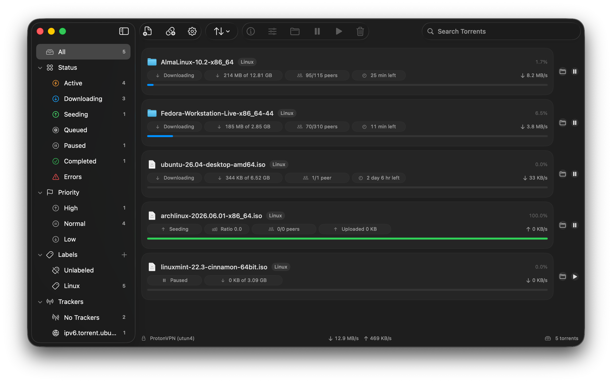

<p align="center">
  
</p>

<h1 align="center">Torrent 7</h1>

<p align="center">
  A modern and hardened torrent client for macOS.
</p>

<p align="center">
  <strong>Requires macOS 26 on Apple silicon.</strong>
</p>

<p align="center">
  
</p>

## Table of Contents

- [Purpose](#purpose)
- [Architecture](#architecture)
- [Features](#features)
- [Security and Hardening](#security-and-hardening)
- [Sandbox Model](#sandbox-model)
- [Dependencies](#dependencies)
- [Build](#build)
- [Diagnostics and Tests](#diagnostics-and-tests)

## Purpose

Torrent 7 is a minimal macOS 26 torrent client built with SwiftUI and
libtorrent-rasterbar 2.x. It ships the torrent engine as an embedded,
application-scoped XPC service so the GUI does not load libtorrent or the C++
bridge. It targets Apple silicon as an arm64e app and leans
into Apple's pointer-authentication model, including PAC-enabled Swift, C, and
C++ code where the toolchain supports it. It also opts into Apple's Enhanced
Security entitlements, including hardened heap, dyld read-only, platform
restrictions, and checked allocations for hardware memory tagging / MTE-class
mitigation on supported systems. The app is designed around App Sandbox, static
third-party linking, and a hardened native app bundle.

The goal is not to be the largest torrent client. The goal is to keep the common
workflow fast and understandable: add a torrent or magnet link, choose where it
downloads, inspect transfer details when needed, and keep the security boundary
as small and explicit as possible.

## Architecture

Torrent 7 has two separately sandboxed executables. The pure-Swift GUI owns
SwiftUI state, user consent, and persistent security-scoped bookmarks. It talks
over a versioned, bounded XPC protocol to an embedded engine service, which owns
network access, resume state, native protocol parsing, and libtorrent. Inside
that service, a narrow C ABI remains the language boundary around the C++23
bridge; it is no longer part of the GUI process.

Library rows remain immutable revisioned snapshots. High-cardinality library
and tracker-host snapshots cross XPC as bounded, short-lived paged datasets;
detail data remains demand-driven and revisioned. The rationale, trust
boundaries, state migration, and non-negotiable security invariants are
documented in [Architecture and Security Decisions](Documentation/Architecture.md).

## Features

- Add `.torrent` files, magnet links, Finder-opened torrents, and dragged files.
- Preview torrent contents before adding, including selected files and priorities.
- Pause, resume, remove, reannounce, force recheck, reveal in Finder, and inspect transfers.
- Configure global and per-torrent transfer limits, queue priority, labels, and discovery policy.
- Inspect trackers, web seeds, files, piece maps, peer sources, hashes, and transfer metadata.
- Filter the library by status, priority, labels, and tracker host.
- Show native notifications, Dock badges, and optional Dock transfer-rate labels.
- Persist resume data and active download-folder access across launches.

## Security and Hardening

Torrent 7 treats hardening as part of the product, not a release afterthought.

- **Pure native UI:** SwiftUI for the interface, with tiny AppKit helpers only where
  macOS still requires them, such as Dock and notification integration.
- **Process isolation:** all libtorrent, C++, torrent parsing, native persistence,
  and torrent networking run in an embedded App Sandbox XPC service. The GUI
  executable contains no torrent-engine symbols and has no network entitlement.
- **Swift safety:** Swift 6, strict concurrency checking, strict memory-safety
  checking, and pointer-authentication settings for both Swift executables.
- **Authenticated, bounded IPC:** identified builds require the exact app/service
  signing identifiers from the same Team ID. Versioned envelopes, operation-specific
  payload limits, pre-decode binary-property-list structure limits, epochs,
  monotonic sequences, replay identifiers, queue budgets, typed failures, and
  semantic response validation constrain both sides of the XPC boundary. Wire
  messages are container-rooted; commit-ambiguous response serialization failures
  close the controller instead of being reported as definite rejections. Errors
  after native add begins receive the same treatment because libtorrent may have
  accepted the torrent before a later bridge failure; they are not revoked or
  retried as though rejection were certain.
- **C++ bridge discipline:** C++23, RAII ownership, `std::span`, `std::expected`,
  bounded C ABI buffers, explicit error returns, and no exception crossing into
  Swift. The removal ABI reports native commit separately from asynchronous
  deletion tracking, preventing a post-commit bookkeeping failure from being
  treated as a rejected removal. The bridge is linked only into the engine
  service.
- **Input bounds:** caps for torrent files, magnets, file counts, tracker/web-seed
  counts, tracker host rows, snapshots, piece-map data, XPC payloads, paged
  datasets, queued requests, file descriptors, and open peers.
- **Delegated folder authority:** the GUI persists app-scoped bookmarks, but sends
  only transient delegation bookmarks over XPC. The service validates and scopes
  each resolved directory by canonical path and filesystem identity; capability
  IDs are bound to one controller and engine epoch. Prepared adds hold an
  exclusive authorization transaction and always end in an exact capability-set
  replacement or controller termination. Local bookmark/path validation failures
  fail closed too, and restart reuses only an exactly reconciled capability set.
- **Service-authoritative network policy:** the engine starts blocked. A network
  binding can unblock it only after an independent service-side interface monitor
  validates the interface fingerprint and VPN service identity. Constrained
  interface changes, disconnects, replacement failures, and monitoring failures
  block networking. A revocation that preempts an in-flight controller request
  closes that controller and automatically replaces it from a fresh blocked
  handshake without replaying ambiguous work. Independent short containment and
  longer cleanup watchdogs cover pre-authority startup, native restart, explicit
  shutdown, disconnect, and scope cleanup, terminating only the helper if native
  progress stalls.
- **Static dependencies:** libtorrent and OpenSSL are linked statically. The final
  app bundle contains no third-party dylibs and exactly two Mach-O executables:
  the GUI and its engine service.
- **Signing:** both executables use hardened runtime, `restrict`, library
  validation, and separately reviewed sandbox entitlements. Identified builds
  require valid matching Team IDs.
- **Enhanced Security entitlements:** hardened process, hardened heap, dyld
  read-only, platform restrictions, and checked allocations are enabled. The
  soft-mode checked-allocation entitlement is intentionally not used, so memory
  tag violations are treated as hard failures on systems that enforce them.
- **Compiler hardening:** arm64e builds use stack protection, PIE codegen, fortify,
  hidden visibility, pointer authentication, branch target identification,
  straight-line speculation hardening, jump-table hardening, typed allocation
  hardening, libc++ hardening, and trap-only UBSan for release bridge code.
- **Network privacy defaults:** a coarse libtorrent client identity is used, anonymous
  mode is enabled by default, DHT privacy lookups are enabled, and local discovery
  is disabled by default.

Torrent 7 can bind libtorrent connections to a selected interface and can use VPN
interfaces only, but hostname lookup still uses macOS system DNS. This is app-level
policy, not a system-wide VPN kill switch.

## Sandbox Model

Torrent 7 splits authority between two App Sandbox profiles:

| Authority or responsibility | GUI application | Engine XPC service |
| --- | --- | --- |
| User-selected read/write and app-scoped bookmark entitlements | Present | Absent |
| Delegated download-folder access | Creates delegation from an active persistent scope | Holds a transient controller-scoped capability |
| Outbound and inbound network entitlements | Absent | Present |
| SwiftUI, Finder, notifications, and user preferences | Yes | No |
| Libtorrent, C++ bridge, resume state, and torrent payload I/O | No | Yes |
| Hardened process, hardened heap, dyld read-only, platform restrictions, checked allocations | Yes | Yes |

The GUI stores persistent app-scoped bookmarks only for the default download
folder and active torrent-specific folders. While one of those scopes is active,
it creates a transient bookmark that delegates the current sandbox extension to
the service. The service does not persist that bookmark: it explicitly starts
and balances the delegated scope, holds a verified directory descriptor, and
invalidates the capability when the controller disconnects.

Resume data and removal tombstones now live in the service's container and are
written with owner-only permissions and durability barriers. A one-time,
descriptor-based migration copies allowlisted legacy files into service-owned
state without granting the service path access to the GUI container or mutating
the legacy tree. Both executable bundles enable file quarantine, including the
service that creates downloaded payloads.

## Dependencies

The production app builds pinned dependencies into local static artifacts:

| Dependency | Version | Use |
| --- | --- | --- |
| libtorrent-rasterbar | 2.1.0 | Torrent engine |
| OpenSSL | 3.5.7 LTS | TLS support for libtorrent |
| Boost | 1.91.0 headers | Header-only Boost pieces used by libtorrent |

Homebrew supplies build tools only; it is not a runtime dependency source for the
app bundle. OpenSSL archives are verified with SHA-256 and a pinned upstream PGP
signing fingerprint. Boost is verified by SHA-256. Libtorrent is fetched from a
pinned tag and commit through a local source cache, then receives an ordered,
hashed patch series for Xcode compatibility, network boundaries, and storage
confinement. WebTorrent support stays disabled to avoid adding its unused
protocol and dependency surface.
The app bundle also contains `ThirdPartyNotices.txt`; release verification requires
it to exactly match the reviewed notices in `Packaging/ThirdPartyNotices.txt`.

## Build

Requirements:

- macOS 26 on Apple silicon
- Xcode 26 or newer
- Homebrew build tools

Install build tools:

```sh
brew install cmake ninja gnupg
```

Build the app:

```sh
Scripts/build-app.zsh
```

The output is:

```text
.build/App/Torrent 7.app
```

By default the app is ad-hoc signed for local development. This default does not
require a signing identity or Apple Developer credentials, and both bundles are
explicitly marked for reduced-assurance development XPC peer authentication.
Identified builds omit that switch and use mutual same-team requirements.

Verify the built app:

```sh
Scripts/verify-app.zsh
```

The verifier requires both signed entitlement dictionaries to exactly match the
canonical GUI and engine allowlists. It also checks the embedded-service identity,
matching signature mode and Team IDs, quarantine policy, hardened runtime flags,
the exact two-executable code inventory, and an allowlist of Mach-O load paths.
Missing, changed, or unexpected authority fails verification.

Use a shared dependency source cache if desired:

```sh
SOURCE_CACHE_DIR=/path/to/source-cache Scripts/build-app.zsh
```

### Distribution release

Store notarization credentials in the login keychain once, rather than placing
credentials in the repository or command history:

```sh
xcrun notarytool store-credentials torrent7-notary
```

Build, Developer ID sign, notarize, staple, verify with Gatekeeper, and archive
a distribution release with:

```sh
SIGN_IDENTITY="Developer ID Application: Example, Inc. (ABCDE12345)" \
EXPECTED_TEAM_ID="ABCDE12345" \
NOTARYTOOL_PROFILE="torrent7-notary" \
Scripts/release-app.zsh
```

The release script requires a release build, a Developer ID Application
identity with the expected Team ID, a trusted signing timestamp, an accepted
notarization result, a valid stapled ticket, and successful `spctl` assessment.
Its final output is:

```text
.build/Release/Torrent 7.zip
```

To re-verify an already notarized app:

```sh
EXPECTED_TEAM_ID="ABCDE12345" \
Scripts/verify-app.zsh --mode distribution
```

## Diagnostics and Tests

Run the Swift test suite:

```sh
Scripts/test-swift.zsh
```

Run the C++ bridge test suite:

```sh
Scripts/test-bridge.zsh
```

Run the focused libtorrent network and storage security regressions:

```sh
Scripts/test-libtorrent-security.zsh
```

Run the bridge static-analysis pass:

```sh
Scripts/analyze-bridge.zsh
```

Run the opt-in maximum snapshot transport probe in release mode:

```sh
Scripts/benchmark-snapshot-transport.zsh
```

The probe prints native C-ABI copy, Swift mapping/sorting, end-to-end latency,
and incremental footprint measurements inside the engine implementation. The
XPC boundary now pages the resulting high-cardinality datasets independently.
The probe does not use wall-clock assertions; review gates are documented in
[Architecture and Security Decisions](Documentation/Architecture.md).

`clang-tidy` support is optional:

```sh
brew install llvm
```

Build a sanitizer diagnostics app:

```sh
SANITIZER_DIAGNOSTICS=1 Scripts/build-app.zsh
```

Diagnostics builds use a separate dependency prefix, ASan/UBSan reporting
instrumentation for libtorrent and the bridge, and a separate app identity:

```text
.build/App-Diagnostics/Torrent 7 (debug).app
app.torrent7.debug
```
