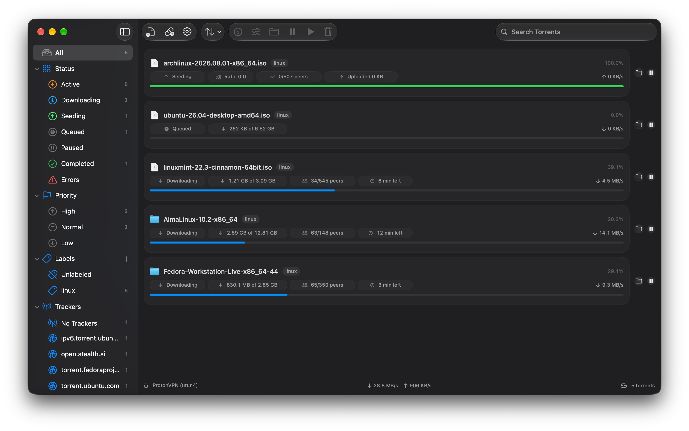

<p align="center">
  
</p>

<h1 align="center">Torrent 7</h1>

<p align="center">
  A modern and hardened torrent client for macOS.
</p>

<p align="center">
  <strong>Requires macOS 26 on Apple silicon.</strong>
</p>

<p align="center">
  
</p>

## Table of Contents

- [Purpose](#purpose)
- [Architecture](#architecture)
- [Features](#features)
- [Security and Hardening](#security-and-hardening)
- [Sandbox Model](#sandbox-model)
- [Dependencies](#dependencies)
- [Build](#build)
- [Diagnostics and Tests](#diagnostics-and-tests)

## Purpose

Torrent 7 is a minimal macOS 26 torrent client built with SwiftUI and
libtorrent-rasterbar 2.x. It ships the torrent engine as an application-scoped
Enhanced Security helper extension so the GUI does not load libtorrent or the
C++ bridge. It targets Apple silicon as an arm64e app and leans
into Apple's pointer-authentication model, including PAC-enabled Swift, C, and
C++ code where the toolchain supports it. It also opts into Apple's Enhanced
Security entitlements, including hardened heap, dyld read-only, platform
restrictions, and checked allocations for hardware memory tagging / MTE-class
mitigation, including pure-data allocations, on supported systems. The app is
designed around App Sandbox, static third-party linking, and a hardened native
app bundle.

The goal is not to be the largest torrent client. The goal is to keep the common
workflow fast and understandable: add a torrent or magnet link, choose where it
downloads, inspect transfer details when needed, and keep the security boundary
as small and explicit as possible.

## Architecture

Torrent 7 has two separately sandboxed executables. The pure-Swift GUI owns
SwiftUI state, user consent, persistent security-scoped bookmarks, storage
claims, destination creation, and payload deletion. It talks over a versioned,
bounded XPC protocol to a system-managed engine extension, which owns network
access, resume state, native protocol parsing, and libtorrent. Payload I/O is
pathless across this boundary: the helper asks a mutually authenticated GUI
broker for one exact file descriptor at a time. Inside the helper, a narrow C
ABI remains the language boundary around the C++23 bridge; it is no longer part
of the GUI process.

Library rows remain immutable revisioned snapshots. High-cardinality library
and tracker-host snapshots cross XPC as bounded, short-lived paged datasets;
detail data remains demand-driven and revisioned. The rationale, trust
boundaries, state ownership, and non-negotiable security invariants are
documented in [Architecture and Security Decisions](Documentation/Architecture.md).

## Features

- Add `.torrent` files, magnet links, Finder-opened torrents, and dragged files.
- Preview torrent contents before adding, including selected files and priorities.
- Pause, resume, remove, reannounce, force recheck, reveal in Finder, and inspect transfers.
- Configure global and per-torrent transfer limits, queue priority, labels, and discovery policy.
- Inspect trackers, web seeds, files, piece maps, peer sources, hashes, and transfer metadata.
- Filter the library by status, priority, labels, and tracker host.
- Show native notifications, Dock badges, and optional Dock transfer-rate labels.
- Persist resume data and active download-folder access across launches.

## Security and Hardening

Torrent 7 treats hardening as part of the product, not a release afterthought.

- **Pure native UI:** SwiftUI for the interface, with tiny AppKit helpers only where
  macOS still requires them, such as Dock and notification integration.
- **Process isolation:** all libtorrent, C++, torrent parsing, native persistence,
  and torrent networking run in an App Sandbox Enhanced Security helper
  extension. The GUI executable contains no torrent-engine symbols and has no
  network entitlement. ExtensionFoundation performs application-scoped
  discovery and process launch; the client retains one process coordinator and
  creates a fresh authenticated XPC session for each controller generation.
- **Swift safety:** Swift 6, strict concurrency checking, strict memory-safety
  checking, and pointer-authentication settings for both Swift executables.
- **Authenticated, bounded IPC:** identified builds require the exact app/helper
  signing identifiers from the same Team ID. Versioned envelopes, operation-specific
  JSON and raw-attachment limits, pre-decode JSON depth, value-node, and
  individual string/primitive limits,
  epochs, monotonic sequences, replay identifiers, queue budgets, typed
  failures, and semantic response validation constrain both sides of the XPC
  boundary. JSON cannot alias values, so repeated decoded leaf content must
  consume repeated bounded wire bytes. Typed JSON messages are container-rooted;
  bounded raw torrent bytes travel separately for preview and add operations,
  while dense piece maps use a validated bit-packed `Data` field. Neither raw
  attachment is echoed in a response. Commit-ambiguous response
  serialization failures close the controller instead of being reported as
  definite rejections. Errors
  after native add begins receive the same treatment because libtorrent may have
  accepted the torrent before a later bridge failure; they are not revoked or
  retried as though rejection were certain.
- **C++ bridge discipline:** C++23, RAII ownership, `std::span`, `std::expected`,
  and no exception crossing into Swift. The C ABI declares nullability,
  synchronous borrows, and byte/element bounds so Swift imports its buffers as
  lifetime-scoped `Span` wrappers; production bridge calls use those wrappers
  rather than separate raw pointers and caller-supplied counts. Native removal
  only untracks a torrent and retires its resume record; the GUI performs any
  authenticated payload deletion through its storage journal. The bridge is
  linked only into the engine helper extension.
- **Input bounds:** caps for torrent files, magnets, file counts, tracker/web-seed
  counts, tracker host rows, snapshots, piece-map data, XPC payloads, paged
  datasets, queued requests, file descriptors, and open peers.
- **Exact-file storage broker:** the GUI alone persists bookmarks, plans
  destinations, owns durable storage claims, and deletes payloads. The helper
  receives an authenticated anonymous broker endpoint, then requests pathless
  `(claimID, generation, fileIndex, access)` handles. The broker resolves every
  component relative to verified directory descriptors, rejects symlinks and
  non-regular files, and returns only the exact descriptor requested. Libtorrent
  has no pathname fallback. Imported existing data is never automatically
  deleted. Path strings are not treated as secret: an issued descriptor may
  reveal its pathname. Claim revocation denies future broker opens but cannot
  recall a descriptor or data already delivered.
- **Helper-authoritative network policy:** the engine starts blocked. A network
  binding can unblock it only after the helper-side interface monitor validates
  the interface fingerprint and VPN service identity. The networkless GUI gets a
  bounded, revisioned picker snapshot from that helper; raw local addresses do
  not cross the XPC boundary. Constrained
  interface changes, disconnects, replacement failures, and monitoring failures
  block networking. A revocation that preempts an in-flight controller request
  closes that controller and automatically replaces it from a fresh blocked
  handshake without replaying ambiguous work. Independent short containment and
  longer cleanup watchdogs cover pre-authority startup, native restart, explicit
  shutdown, disconnect, and scope cleanup, terminating only the helper if native
  progress stalls.
- **Static dependencies:** libtorrent and BoringSSL are linked statically. The final
  app bundle contains no third-party dylibs and exactly two Mach-O executables:
  the GUI and its engine extension.
- **Narrow TLS surface:** HTTPS uses BoringSSL's buffer-only client method and
  macOS system trust with strict hostname binding and network certificate fetching
  disabled. TLS 1.0/1.1, 0-RTT, legacy TLS 1.2 ciphers, and unused SSL-torrent
  peers are disabled; UPnP's encryption-only HTTPS context remains isolated from
  authenticated tracker and web-seed traffic.
- **Signing:** both executables use hardened runtime, `restrict`, library
  validation, and separately reviewed sandbox entitlements. Identified builds
  require valid matching Team IDs.
- **Enhanced Security entitlements:** hardened process, hardened heap, dyld
  read-only, platform restrictions, and checked allocations with pure-data
  enforcement are enabled. The soft-mode checked-allocation entitlement is
  intentionally not used, so memory tag violations are treated as hard failures
  on systems that enforce them.
- **Compiler hardening:** arm64e builds use stack protection, PIE codegen, fortify,
  hidden visibility, pointer authentication, branch target identification,
  straight-line speculation hardening, jump-table hardening, typed allocation
  hardening, libc++ hardening, trap-only undefined-behavior and local-bounds
  checks for release BoringSSL and libtorrent code, and the extended trap-only
  sanitizer set for release bridge code.
  Stored bridge callbacks and their long-lived opaque contexts use role- and
  address-diversified authentication. The dependency build also rejects raw C
  allocation and untyped global C++ allocation imports in the final libtorrent
  archive.
- **Network privacy defaults:** a coarse libtorrent client identity is used, anonymous
  mode and DHT privacy lookups are enabled by default, strict BEP 42 node-ID
  enforcement and DHT routing/search IP-diversity restrictions are pinned on,
  and incoming connections, peer exchange, and local discovery are disabled by
  default. HTTPS trackers are preferred with HTTP and UDP retained as fallback;
  web seeds require HTTPS by default. Tracker, DHT, PEX, and persisted peer endpoints
  must be globally routable for the lifetime of a torrent; explicitly enabled LSD
  is the only local-peer discovery path. Outbound-only sessions still use DHT peer
  discovery without advertising an unreachable peer endpoint. Eligible public
  torrents query DHT alongside trackers by default; an optional fallback policy
  waits until every usable tracker endpoint has failed or timed out.

Torrent 7 can bind libtorrent connections to a selected interface and can use VPN
interfaces only, but hostname lookup still uses macOS system DNS. This is app-level
policy, not a system-wide VPN kill switch.

## Sandbox Model

Torrent 7 splits authority between two App Sandbox profiles:

| Authority or responsibility | GUI application | Engine helper extension |
| --- | --- | --- |
| User-selected read/write and app-scoped bookmark entitlements | Present | Absent |
| Payload filesystem authority | Owns bookmarks, directory descriptors, durable claims, and the exact-file broker | Receives only broker-returned exact file descriptors |
| Outbound and inbound network entitlements | Absent | Present |
| SwiftUI, Finder, notifications, and user preferences | Yes | No |
| Libtorrent, C++ bridge, and resume state | No | Yes |
| Payload destination creation and deletion | Yes | No |
| Hardened process, hardened heap, dyld read-only, platform restrictions, checked allocations | Yes | Yes |

The GUI stores persistent app-scoped bookmarks only for the default download
folder and active torrent-specific folders. It resolves those scopes, traverses
and creates destinations relative to verified directory descriptors, and
transfers only exact regular-file descriptors through the storage broker. No
bookmark, parent directory descriptor, payload path, rename authority, or
deletion authority is transmitted to the helper. A received descriptor may
reveal its path, but the broker exposes no path-taking operation, the helper
receives no directory capability, and its sandbox has no user-selected-file
authority.

Resume data and removal tombstones live in the helper's container and are
written with owner-only permissions and durability barriers. Both executable
bundles enable file quarantine, including the helper that creates downloaded
payloads.

## Dependencies

The production app builds pinned dependencies into local static artifacts:

| Dependency | Version | Use |
| --- | --- | --- |
| libtorrent-rasterbar | 2.1.1 | Torrent engine |
| BoringSSL | `b0760837957bf86bd2014d258a948ee76f43c83f` | TLS support for libtorrent |
| Boost | 1.92.0 headers | Header-only Boost pieces used by libtorrent |

Homebrew supplies build tools only; it is not a runtime dependency source for the
app bundle. BoringSSL is fetched from its official repository at an exact commit
and tree, with a reproducible source-archive digest. Its build compiles only the
static `crypto` and `ssl` targets with assembly and tests disabled and
`OPENSSL_SMALL` enabled; tools, shared libraries, and the `decrepit` and `pki`
library targets are not staged. An ordered, hashed BoringSSL patch series removes
the remaining no-assembly runtime dispatch, authenticates active TLS, cipher,
digest, key, BIO, and EC method state with address-and-role-diversified PAC, and
preserves concrete allocation classes through BoringSSL's cleansing allocator.
The authenticated pristine checkout remains separate from each profile's patched
build worktree. Boost is verified by SHA-256, then receives an ordered,
hashed patch series that authenticates the active Asio scheduler and reactor
operation callbacks, owning and non-owning executor callbacks and contexts,
polymorphic executor dispatch and carrier state, and service teardown with
address-and-role-diversified PAC. It also preserves concrete allocation types
through Asio's small-block recycler and keeps cached blocks type-segregated.
Libtorrent is fetched
from a pinned tag and commit through a local source cache, then receives its own
ordered, hashed patch series for Xcode compatibility, network boundaries, storage
confinement, bounded pread recheck hashing, and complete typed-allocation
coverage. WebTorrent support stays
disabled to avoid adding its unused protocol and dependency surface. SSL-torrent
peers are likewise disabled because the application has no certificate-control
workflow for them.
The app bundle also contains `ThirdPartyNotices.txt`; release verification requires
it to exactly match the reviewed notices in `Packaging/ThirdPartyNotices.txt`.

## Build

Requirements:

- macOS 26 on Apple silicon
- Xcode 26.6 (build 17F113)
- Homebrew build tools

Install build tools:

```sh
brew install cmake ninja
```

Verify the selected Xcode, macOS SDK, and Swift toolchain:

```sh
Scripts/verify-xcode.zsh
```

Build the app:

```sh
Scripts/build-app.zsh
```

The output is:

```text
.build/App/Torrent 7.app
```

By default the app is ad-hoc signed for local development. This default does not
require a signing identity or Apple Developer credentials, and both bundles are
explicitly marked for reduced-assurance development XPC peer authentication.
Identified builds omit that switch and use mutual same-team requirements.

Verify the built app:

```sh
Scripts/verify-app.zsh
```

The verifier requires both signed entitlement dictionaries to exactly match the
canonical GUI and engine allowlists. It also checks the embedded helper identity,
the exact application-scoped Enhanced Security metadata, matching signature
mode and Team IDs, quarantine policy, hardened runtime flags, the exact
two-executable code inventory, and an allowlist of Mach-O load paths. Missing,
changed, or unexpected authority fails verification.

Use a shared dependency source cache if desired:

```sh
SOURCE_CACHE_DIR=/path/to/source-cache Scripts/build-app.zsh
```

### Distribution release

Store notarization credentials in the login keychain once, rather than placing
credentials in the repository or command history:

```sh
xcrun notarytool store-credentials torrent7-notary
```

Build, Developer ID sign, notarize, staple, verify with Gatekeeper, and archive
a distribution release with:

```sh
SIGN_IDENTITY="Developer ID Application: Example, Inc. (ABCDE12345)" \
EXPECTED_TEAM_ID="ABCDE12345" \
NOTARYTOOL_PROFILE="torrent7-notary" \
Scripts/release-app.zsh
```

The release script requires a release build, a Developer ID Application
identity with the expected Team ID, a trusted signing timestamp, an accepted
notarization result, a valid stapled ticket, and successful `spctl` assessment.
Its final output is:

```text
.build/Release/Torrent 7.zip
```

To re-verify an already notarized app:

```sh
EXPECTED_TEAM_ID="ABCDE12345" \
Scripts/verify-app.zsh --mode distribution
```

## Diagnostics and Tests

Run the Swift test suite:

```sh
Scripts/test-swift.zsh
```

Run the C++ bridge test suite:

```sh
Scripts/test-bridge.zsh
```

Run the focused libtorrent network and storage security regressions:

```sh
Scripts/test-libtorrent-security.zsh
```

That suite also runs focused BoringSSL and Boost.Asio PAC code-generation,
callback replay, and typed-allocation tests. They can be invoked directly with:

```sh
Scripts/test-boringssl-hardening.zsh
Scripts/test-boost-asio-pac.zsh
Scripts/test-boost-asio-recycling-allocator.zsh
```

Run the bridge static-analysis pass:

```sh
Scripts/analyze-bridge.zsh
```

Run the opt-in maximum snapshot transport probe in release mode:

```sh
Scripts/benchmark-snapshot-transport.zsh
```

The probe prints native C-ABI copy, Swift mapping/sorting, end-to-end latency,
and incremental footprint measurements inside the engine implementation. The
XPC boundary now pages the resulting high-cardinality datasets independently.
The probe does not use wall-clock assertions; review gates are documented in
[Architecture and Security Decisions](Documentation/Architecture.md).

`clang-tidy` support is optional:

```sh
brew install llvm
```

Run the Bridge with AddressSanitizer and UndefinedBehaviorSanitizer reporting:

```sh
SANITIZER_PROFILE=address Scripts/test-bridge.zsh
```

Run the Bridge with ThreadSanitizer and UndefinedBehaviorSanitizer reporting:

```sh
SANITIZER_PROFILE=thread Scripts/test-bridge.zsh
```

Build an AddressSanitizer diagnostics app:

```sh
SANITIZER_PROFILE=address Scripts/build-app.zsh
```

Build a ThreadSanitizer diagnostics app:

```sh
SANITIZER_PROFILE=thread Scripts/build-app.zsh
```

Build and verify the regular, AddressSanitizer, and ThreadSanitizer apps:

```sh
Scripts/build-all-apps.zsh
```

Sanitizer profiles use separate dependency and Swift build directories, disable
fortify, enable libc++ debug hardening, and apply the selected primary sanitizer
to BoringSSL, libtorrent, and the Bridge. Libtorrent and the Bridge additionally
retain the supported undefined-behavior checks. The apps have distinct bundle
identities and can coexist with production and each other:

```text
.build/App-Address/Torrent 7 (ASan).app   app.torrent7.asan
.build/App-Thread/Torrent 7 (TSan).app   app.torrent7.tsan
```

Run the correctness-only Enhanced Security lifecycle under ThreadSanitizer:

```sh
SANITIZER_PROFILE=thread SKIP_BUILD_DEPS=1 \
  Scripts/test-enhanced-security-extension.zsh --automated
```
